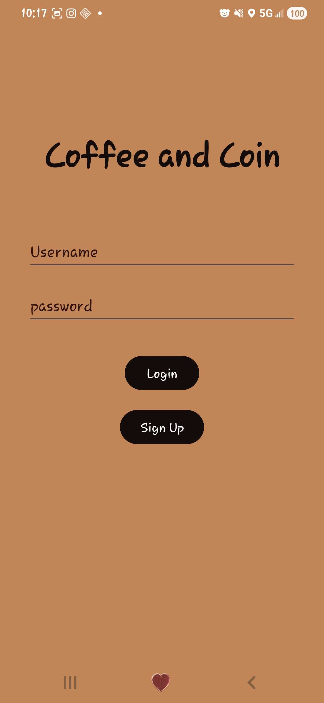
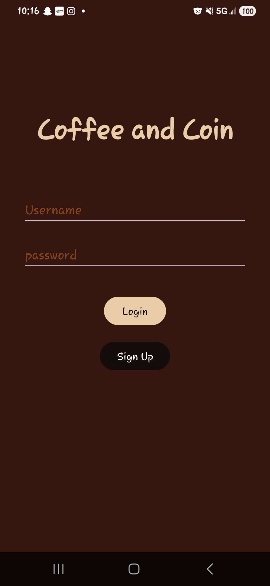
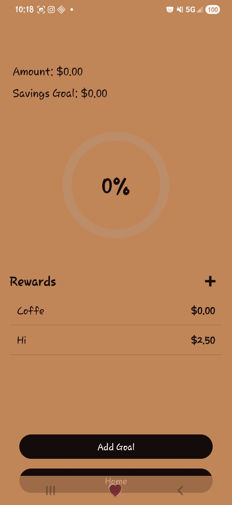
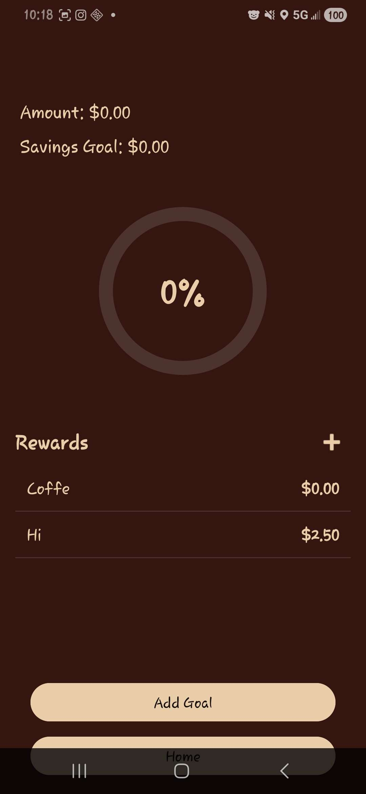
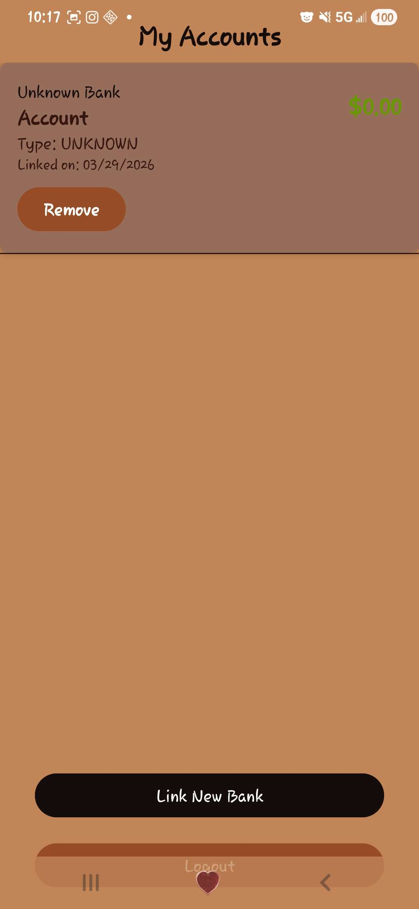
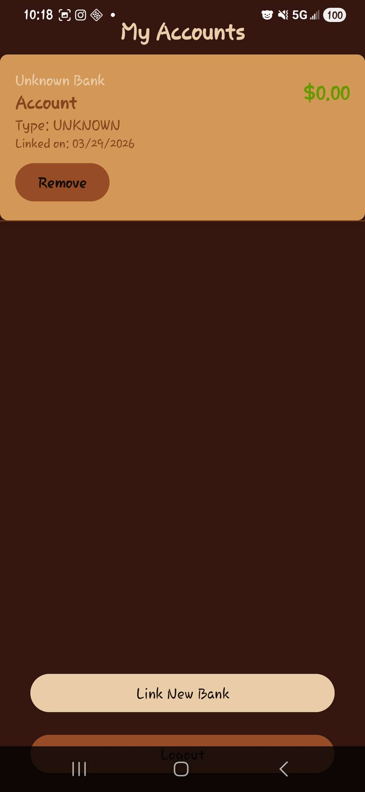

# GrizzHacks Finance App

An Android application designed to help users track their financial goals and earn rewards as they save.

## Features

- **Plaid Integration**: Securely link your bank accounts to track real-time balances.
- **Goal Tracking**: Set custom savings goals for each linked account.
- **Visual Progress**: Circular progress bars and percentage displays show how close you are to your targets.
- **Rewards System**: 
  - Add custom rewards (e.g., "Buy a Coffee", "New Video Game").
  - Assign a **Price** to each reward.
  - Track rewards directly within the account progress screen.
- **Real-time Database**: Powered by Firebase to ensure your data is always synced across devices.

## Screenshots

### Home Screen
| Light Mode                                | Dark Mode                               |
|-------------------------------------------|-----------------------------------------|
|  |  |

### Progress & Rewards
| Light Mode                                        | Dark Mode                                        |
|---------------------------------------------------|--------------------------------------------------|
|  |  |

### Account Display
| Light Mode                                      | Dark Mode                                     |
|-------------------------------------------------|-----------------------------------------------|
|  |  |

## Tech Stack

- **Language**: Java
- **Database**: Firebase Realtime Database
- **Authentication**: Firebase Auth
- **Banking API**: Plaid SDK
- **UI Components**: Material Design, ConstraintLayout, Custom Circular ProgressBar

## Setup & Deployment

### Prerequisites
- Android Studio Ladybug or newer.
- A Firebase project.
- A Plaid developer account.

### 1. Firebase Configuration
- Create a project in the [Firebase Console](https://console.firebase.google.com/).
- Add an Android app with the package name `com.example.finance_app`.
- Download `google-services.json` and place it in the `app/` directory of this project.
- Enable **Email/Password Authentication** and **Realtime Database**.

### 2. Plaid Configuration
- Obtain your `client_id` and `secret` from the [Plaid Dashboard](https://dashboard.plaid.com/).
- Set up a simple backend (or use Firebase Functions) to exchange public tokens for access tokens.
- Update the `PlaidService.java` with your backend URL.

### 3. Build and Run
- Open the project in Android Studio.
- Sync Project with Gradle Files.
- Connect an Android device or start an emulator.
- Click **Run 'app'** (Green play button).

### 4. Deploying the APK
- Go to `Build` > `Build Bundle(s) / APK(s)` > `Build APK(s)`.
- Once finished, a notification will appear with a "locate" link to the generated `.apk` file.
- Transfer this file to any Android device to install and test.

## Recent Updates

- Fixed issue with account deletion not syncing with Firebase.
- Added a dynamic Rewards list to the Progress screen.
- Implemented a "Price-based" reward system with a quick-add popup.
